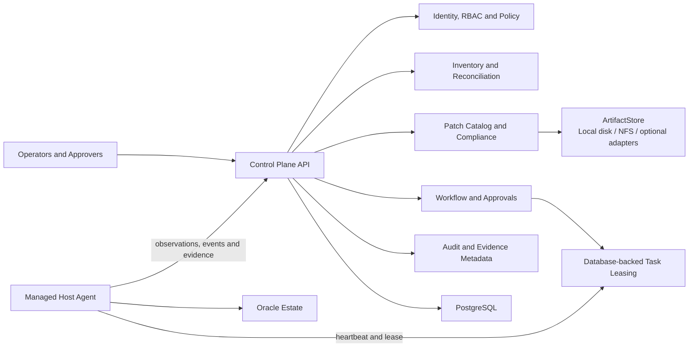
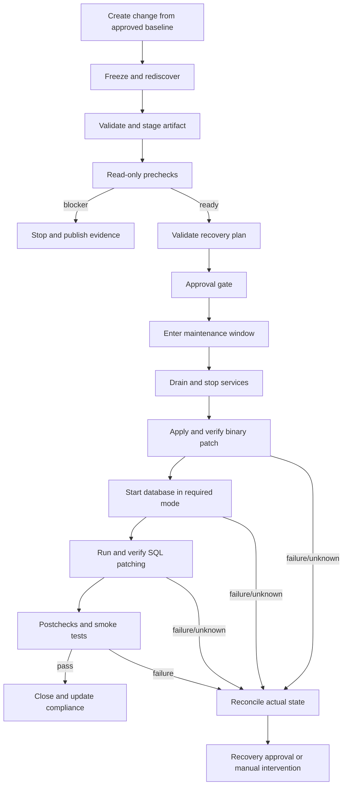

# Oracle Patching Utility

## Architecture, Dynamic Discovery, Safety Model, and Delivery Blueprint

| Document attribute | Value |
| --- | --- |
| Status | Architecture baseline ready for implementation |
| Version | 0.1 |
| Date | 9 July 2026 |
| Project type | Greenfield implementation |
| Initial target | Oracle Database 19c on Oracle Linux x86-64; standalone first |
| Deployment | Fully on-premises capable; cloud services are optional adapters |
| First implementation package | `CON-01` — Canonical resource identities |

Companion editable diagrams: [`Oracle_Patching_Utility_Architecture.drawio`](Oracle_Patching_Utility_Architecture.drawio)

This is the single implementation baseline for the project. It contains the
system architecture, OEM-style dynamic discovery model, inventory and identity
rules, patch-safety model, security boundaries, principal challenges, quality
gates, delivery sequence, and the complete register of 114 independently
assignable work packages.

---

# Part I — Architecture and Program Charter

## 1. Executive summary

The utility will use a dedicated host agent, similar in operating model to an
enterprise monitoring agent, to discover Oracle installations dynamically and
report evidence-backed observations to a central control plane. The platform
will reconcile those observations into a current inventory, compare that
inventory with approved patch baselines, perform read-only readiness checks,
and execute only explicitly approved patch workflows.

The agent is not a remote shell. It exposes only fixed, versioned operations
with typed parameters. Discovery, prechecks, and patch execution remain
separate capabilities with separate privilege profiles. A control-plane
timeout or lost heartbeat is never interpreted as an Oracle failure or as
permission to repeat a destructive operation.

The program is divided into 114 independently testable work packages. Parallel
development begins only after canonical identifiers, resource schemas, result
envelopes, and protocol-compatibility rules are agreed. Speed comes from
parallel work behind stable contracts, not from combining the platform into
one large implementation task.

> **Core outcome:** Discover accurately, decide transparently, execute
> deterministically, verify independently, and retain evidence for every
> transition.

## 2. Mission and architectural principles

The mission is to build a deployment-neutral Oracle estate discovery and
patching platform with OEM-style managed agents, deterministic workflows, and
evidence for every decision and operation.

The following rules are non-negotiable:

1. The agent discovers dynamically; administrators do not manually recreate
   the technical Oracle estate in the platform.
2. Discovery is read-only and independent from patch-execution privileges.
3. Agent observations are immutable. Current inventory is a deterministic
   projection produced by reconciliation.
4. Missing data from a partial scan never means that a resource was deleted.
5. Names, SIDs, hostnames, IP addresses, and Data Guard roles are attributes,
   not stable identities.
6. Every material fact retains its source, collection time, confidence,
   collector version, and evidence digest.
7. The agent executes fixed, typed operations. There is no arbitrary shell,
   generic run-as endpoint, uploaded script, or control-plane-supplied SQL.
8. Patch execution requires fresh discovery, completed prechecks, policy
   validation, approval, an active maintenance window, and recovery evidence.
9. A destructive retry first probes actual Oracle state.
10. Cloud services are optional adapters. The platform must operate with
    on-premises PostgreSQL and filesystem/NFS artifact storage.
11. AI may summarize evidence or propose a plan; it cannot approve, dispatch,
    or execute a patch operation.
12. Standalone Oracle 19c on Oracle Linux is proven first, followed by Data Guard and
    then Grid Infrastructure/RAC.

## 3. Scope

### 3.1 Initial release scope

- Oracle Database 19c on Oracle Linux x86-64.
- Database Release Updates, with OJVM as a separate patch profile.
- Standalone databases first.
- Dynamic discovery of hosts, Oracle homes, databases, CDBs/PDBs, listeners,
  services, current patch inventory, and topology evidence.
- Patch catalog, approved baselines, compliance, prechecks, approvals,
  scheduling, execution, validation, recovery coordination, reporting, and
  audit.
- Local filesystem storage for development and small installations.
- Shared filesystem/NFS storage for on-premises production.
- Optional storage and enterprise-system adapters through published
  interfaces.

### 3.2 Subsequent profiles

1. Data Guard topology discovery and role-aware orchestration.
2. OJVM-specific eligibility, execution, and recovery.
3. Grid Infrastructure, ASM, and RAC rolling/non-rolling workflows.
4. Additional Oracle and operating-system versions through tested adapters.

### 3.3 Explicit non-goals

- Generic SSH, arbitrary shell, uploaded scripts, or user-supplied SQL.
- Automatic patching merely because a target is non-compliant.
- Assuming that every Oracle failure can be rolled back automatically.
- Reimplementing Oracle conflict logic when Oracle tools are authoritative.
- Requiring Kubernetes, public cloud services, or public runtime connectivity.
- AI-driven approval or execution.
- Downloading or redistributing licensed Oracle patches outside an explicitly
  authorized acquisition process.

## 4. System architecture

Start with a modular control plane and a separately installed managed host
agent. API, worker, and scheduler processes may be deployed separately, but
initially share one codebase and PostgreSQL system of record. This keeps
transaction boundaries understandable while contracts evolve.



### 4.1 Major components

| Component | Responsibility |
| --- | --- |
| Control Plane API | Versioned APIs for agents, inventory, baselines, changes, plans, workflows, approvals, evidence, and reports |
| Identity and Policy | User/workload identity, RBAC, separation of duties, maintenance rules, and policy decisions |
| Inventory | Immutable discovery snapshots, stable identity, deterministic reconciliation, topology, confidence, and history |
| Patch Catalog | Approved metadata, artifact digests, applicability inputs, baselines, and exceptions |
| Compliance | Explainable comparison of observed state with approved desired state |
| Workflow | Persisted DAG, approvals, scheduling, locks, fencing, retries, reconciliation, and compensation plans |
| Managed Agent | Outbound communication, dynamic discovery, typed operations, durable local journal, and evidence |
| ArtifactStore | Provider-neutral streaming access to patch archives and large evidence |
| Audit | Append-only security and business events linked to actors, policy, plans, tasks, and evidence |
| User Experience | Inventory/compliance dashboard, change review, approval inbox, workflow timeline, and reports |

### 4.2 Deployment profiles

| Profile | Control plane | Artifact storage | Cloud dependency |
| --- | --- | --- | --- |
| Developer/lab | Single control-plane node and PostgreSQL | Local filesystem | None |
| On-premises production | HA API/workers and PostgreSQL HA | Shared filesystem/NFS | None |
| Optional private/public cloud | Same product services | Optional S3-compatible adapter | Optional |

Kubernetes is not a requirement. The control plane should support containers
and conventional host/service installation. Oracle Linux agents should eventually be
packaged as signed RPMs. Air-gapped operation must support offline release
bundles, offline patch ingestion, local trust bootstrap, and no SaaS telemetry
dependency.

## 5. OEM-style dynamic discovery

A dedicated OS account runs the agent on each Oracle host. The agent combines
multiple read-only sources because no single source is always complete or
correct. It creates an immutable discovery snapshot and sends it to the control
plane. It does not directly update or delete central inventory records.


### 5.1 Discovery sources

| Area | Sources and facts |
| --- | --- |
| Host | Machine identity, hostnames, interfaces, OS/kernel, architecture, mounts, capacity, time synchronization |
| Oracle installation | `oraInst.loc`, central/local inventory, `oratab`, service definitions, process executable paths |
| Runtime | PMON, listener, ASM, Clusterware, service processes, owning UID, executable real path |
| Oracle home | Canonical path, owner/group, version, OPatch version, installed patches, inventory attachment |
| Listener | Listener configuration, endpoints, status, registered services, owning home |
| Database | DBID, DB unique name, SID, version, CDB/PDB structure, role, open mode, instances, SQL patch registry |
| GI/RAC/ASM | Cluster identity, nodes, GI home, resources, services, ASM, placement, health evidence |
| Data Guard | Configuration relationships, database roles, broker evidence, transport/apply state, lag |
| External enrichers | CMDB, backup product, DNS, monitoring; these enrich but do not silently override Oracle-observed facts |

Runtime/tool output is generally stronger evidence for current state, while
configuration and inventory files remain evidence of stopped resources.
Contradictions must be retained and surfaced rather than silently discarded.

### 5.2 Plugin contract

Every discovery plugin implements the same conceptual contract:

```text
detect(context)  -> capability evidence
collect(context) -> observations + errors + source coverage
validate(data)   -> findings
```

Plugins declare their required OS identity, tools, minimum supported versions,
timeouts, supported platforms, and produced observation kinds. Initial plugins
are host/OS, Oracle inventory/home, standalone database, listener, SQL patch
registry, Data Guard, and GI/ASM/RAC. Unsupported topology must return
`unsupported`, not `healthy`.

### 5.3 Discovery safety

- Run the service under a dedicated unprivileged account.
- Use narrowly scoped privilege rules or a small privileged broker only for
  registered operations that must run as `oracle`, `grid`, or root.
- Build command argument arrays; never accept command strings.
- Use fixed SQL scripts; never accept SQL from the control plane.
- Construct a fixed environment and validate all paths.
- Enforce timeouts, output limits, working-directory controls, and redaction.
- Record executable identity, effective UID/GID, exit status, duration, and
  evidence digest.
- Keep discovery useful even when patch-execution privileges are disabled.

## 6. Inventory identity and reconciliation

### 6.1 Stable identity

Names and placements change, so they cannot be the primary identity.

| Resource | Identity strategy |
| --- | --- |
| Agent | Generated enrollment UUID bound to its workload identity/certificate |
| Host | Installation UUID plus OS machine evidence; detect cloned-machine conflicts |
| Oracle home | Host identity + canonical real path + inventory identity/fingerprint |
| Database | DBID when available, reinforced by DB unique name and creation evidence; never SID alone |
| Instance | Database identity + instance number; node placement remains mutable |
| Listener | Host + owning home + configured listener name; endpoints remain mutable |
| Cluster | Clusterware name plus cluster/OCR identity where available |
| Data Guard configuration | Configuration/database-family identity; role remains mutable |
| ASM | Cluster identity plus ASM/disk-group identity, not display name alone |

Every match decision records its score, evidence, method, and reason codes.
Ambiguous matches enter `identity_conflict`; they are not automatically merged.
Manual merge/split decisions must be audited and reversible at the projection
level.

### 6.2 Snapshot model

```text
DiscoveryRun
  run_id, agent_id, host_id, sequence, collector_versions
  started_at, completed_at, trigger, correlation_id
  overall_status: complete | partial | failed
  source_coverage[], collection_errors[]

Observation
  kind, natural_keys, attributes, relationships[]
  observed_at, source, confidence
  evidence_ref, evidence_digest, status, error

ReconciliationDecision
  run_id, observation_id, resource_id
  action: create | update | unchanged | conflict | candidate_missing
  rule_version, match_method, score, reason_codes[]
```

Current inventory is a projection, not the source of truth. Reconciliation
rules are versioned and replayable.

### 6.3 Absence handling

- One missing scan: `not_observed_this_run`.
- Repeated successful scans with full relevant coverage:
  `suspected_removed`.
- Confirmed absence across the configured evidence threshold:
  `removed_confirmed`.
- Source inaccessible: preserve prior state and mark `unknown` or
  `inaccessible`.
- Stopped but configured resource: `configured_not_running`.
- Partial or failed discovery never removes an inventory resource.

### 6.4 Field ownership

| Owner | Examples | Rule |
| --- | --- | --- |
| Agent | Versions, paths, runtime role/open mode, patches, capacity | Updated only from evidence-backed discovery |
| Administrator | Environment, criticality, business owner, window, policy | Never overwritten by reconciliation |
| Integration | CMDB ID, backup evidence, change ticket | Owned by the named integration |
| Computed | Compliance, staleness, confidence, topology risk, blast radius | Recomputed from versioned rules |

## 7. Patch catalog and deployment-neutral artifacts

Patch metadata is independent from binary storage. A patch manifest contains
the patch identifier, family, product/release, platform/architecture, archive
digest and size, required OPatch version, supersedence/conflict inputs,
execution profile, SQL components, README/reference digest, and approval state.

Do not infer applicability from the filename. Approved metadata plus Oracle
tools remain authoritative. Only verified and reviewed artifacts may become
eligible for staging.

Business records store the following provider-neutral fields:

```text
artifact_id
artifact_kind
sha256
size
media_type
lifecycle_state
retention_class
created_at
```

They do not store bucket names, cloud URLs, NFS paths, or SDK-specific types.
The `ArtifactStore` contract supports streaming read/write, atomic publish,
digest verification, stat/existence, retention, and legal hold.

Initial adapters:

1. Local POSIX filesystem.
2. Shared POSIX/NFS using the same filesystem contract.
3. Optional S3-compatible adapter when a deployment chooses it.

Archive ingestion rejects checksum mismatch, absolute paths, `..` traversal,
unsafe links, device entries, excessive entry counts, and decompression bombs.
Published artifacts are immutable.

## 8. Compliance and blast radius

Compliance compares observed inventory with an approved baseline and returns
an explainable state:

- `compliant`
- `update_required`
- `not_applicable`
- `exception`
- `unknown`

Every result includes reason codes and its input revisions. Stale, partial, or
conflicted inventory cannot look compliant by omission.

Selecting one database is not necessarily selecting one patch target. Several
databases, listeners, or services may share an Oracle home. The plan compiler
must expand the full home-level blast radius before approval and acquire a home
lock before disruptive work.

## 9. Patch planning and workflow

Separate these concepts:

- **Change request:** business scope, risk, window, and authorization.
- **Patch plan:** immutable compiled execution graph.
- **Workflow run:** one execution of an approved plan.
- **Task attempt:** one supervised agent-side attempt for one node.

Approvals bind to the plan hash, target set, target/topology revisions, artifact
digests, risk, policy snapshot, and maintenance window. Material drift
invalidates the approval.



### 9.1 Workflow state model

```text
draft
  -> prechecking
  -> blocked | awaiting_approval
  -> scheduled
  -> running
  -> paused | succeeded | failed
  -> rollback_pending
  -> rolling_back
  -> rolled_back | manual_intervention
```

Rules:

- Terminal states are immutable.
- State transitions use compare-and-set versions.
- Tasks have stable idempotency keys across redelivery.
- A lease identifies one delivery owner; lease expiry means outcome unknown.
- Destructive work uses hierarchical locks and fencing tokens.
- Destructive retry requires postcondition reconciliation.
- Rollback is a precompiled compensation graph, not invented dynamically.
- Some nodes intentionally have no automatic compensation.

### 9.2 Agent task envelope

A task binds at least:

```text
schema_version
task_id, workflow_id, plan_id, node_id
agent_id, target_type, target_id, expected_target_revision
operation_name, operation_version, validated_parameters
artifact_ids and digests
preconditions and expected_postconditions
plan_hash and policy_snapshot_hash
idempotency_key and fencing_token
offline_safety_class
issued_at, expires_at, signature
```

The agent rejects an expired task, stale target revision, stale fencing token,
unsupported operation/version, invalid signature, invalid parameter, or
artifact mismatch before execution.

## 10. Read-only readiness

Prechecks return `pass`, `warning`, `blocker`, or `unknown`, always with reason
codes and evidence. Mandatory checks include:

- Agent health, version, identity, clock, and inventory freshness.
- Artifact digest, platform/release applicability, and approved status.
- OPatch version and detailed inventory.
- Patch conflict/applicability analysis using supported Oracle tooling.
- Staging, Oracle home, inventory, log, rollback, and recovery filesystem space.
- Inventory consistency and absence of active patch locks/processes.
- Database, instance, listener, service, CDB/PDB, role, and open-mode state.
- SQL patch registry and component registry health.
- Invalid-object baseline and relevant active jobs.
- Shared-home blast radius.
- Backup recency, recovery evidence, and recovery-area capacity.
- Maintenance window, approvals, policy, and topology stability.

Any mandatory blocker prevents approval or execution.

## 11. Execution safety and recovery

Patching is a reconciled state machine, not a remote-command sequence. Every
phase defines:

- Preconditions.
- Completion predicate.
- Safe-retry predicate.
- Timeout and interruption behavior.
- Expected side effects.
- Verification operation.
- Evidence requirements.
- Recovery boundary and manual stop conditions.

Exit code zero alone is insufficient. Success requires an independently
observed completion predicate.

### 11.1 Standalone RU phases

1. Freeze target and rediscover.
2. Verify artifact, extraction, ownership, metadata, and applicability.
3. Run all prechecks.
4. Bind and receive approval.
5. Drain traffic and stop only the approved services.
6. Apply the binary patch through a typed adapter.
7. Re-observe and verify binary inventory.
8. Start the database in the required mode.
9. Run the approved SQL patch profile and account for every required PDB.
10. Verify the current SQL-patch attempt and registry state.
11. Compare before/after technical health and application smoke tests.
12. Close the change or enter an approved recovery/manual-intervention plan.

### 11.2 Interrupted-operation rules

- Control-plane disconnection does not authorize a new disruptive phase.
- The local supervisor may finish only the already-authorized atomic phase
  according to its declared offline safety class.
- Agent restart must inspect the local journal and child-process identity.
- Lost acknowledgement triggers observation, not blind re-execution.
- OPatch ambiguity is resolved from actual inventory and logs.
- SQL-patch ambiguity is resolved from the registry and tool logs.
- Stop/start ambiguity is resolved by observing actual service/database state.
- Unknown state is never labeled safe to retry.

Outcome classifications include:

```text
COMPLETE
NOT_STARTED
STILL_RUNNING
SAFE_TO_RETRY
ROLLBACK_REQUIRED
MANUAL_DIAGNOSIS_REQUIRED
```

### 11.3 Recovery

Rollback is a new authorized plan. It may use supported binary rollback,
SQL-patch rollback, out-of-place home switchback, restore points, RMAN
recovery, storage snapshots, or Data Guard recovery. These mechanisms provide
different guarantees.

The platform must stop for manual intervention when it encounters central
inventory inconsistency, ambiguous partial patch state, unclassified SQL-patch
errors, new critical invalid objects, an unpatched required PDB, unexpected
topology/role change, expired recovery evidence, unavailable rollback
artifacts, or a required procedure outside a supported adapter profile.

## 12. Security and trust model

Trust boundaries exist between users and the control plane, identity provider
and control plane, agents and control plane, artifact storage, secret provider,
Oracle/OS privileges, and external enterprise systems. Network location alone
does not create trust.

Mandatory controls:

- TLS everywhere and mutual TLS for agents.
- Unique agent identities, certificate rotation, revocation, and quarantine.
- Signed task envelopes and authenticated/signed results.
- Signed agent packages and verified upgrade manifests.
- Dedicated unprivileged service account.
- Typed privileged operations with fixed executable resolution.
- No secrets in task payloads.
- Short-lived secret retrieval where credentials are necessary.
- Output redaction before logs or evidence leave the host.
- Safe temporary directories and validated paths.
- Artifact and evidence checksums.
- Replay protection, rate limits, and request-size limits.
- RBAC plus attribute/policy-based decisions.
- Separation of requester, publisher, approver, and operator where required.
- Append-only audit records with tamper-evident hash chaining and protected
  backups/anchors.
- SBOM, dependency pinning, vulnerability scanning, and release provenance.

Initial roles include platform administrator, agent enrollment administrator,
patch catalog manager, planner/requester, approver, operator, emergency
operator, auditor, and viewer. Platform administration does not automatically
grant patch-operation authority.

## 13. Failure model and observability

### 13.1 Failure behavior

- **Control plane unavailable:** finish only the already-authorized offline-safe
  phase; start nothing new.
- **Agent lost:** pause and reconcile actual state before retry or recovery.
- **Partial OPatch/SQL patch:** preserve evidence and require a defined recovery
  decision.
- **Stale inventory:** block disruptive work until refreshed.
- **Expired window:** do not start the next disruptive node.
- **Audit/evidence unavailable:** stop before the next disruptive transition.
- **Storage interruption:** do not publish a partial artifact; retain logical
  records and resume through the storage contract.

### 13.2 Correlation

Every event carries the applicable identifiers:

```text
request_id
change_id
plan_id
workflow_id
node_id
task_id
attempt_id
agent_id
target_id
```

Metrics include heartbeat age, agent versions, queue depth/age, lease expiry,
workflow and node duration, reconciliation outcomes, precheck findings,
artifact verification failures, evidence failures, approval age,
policy-denied transitions, manual intervention, rollback, and compliance.

Do not use database names, hostnames, task IDs, or workflow IDs as unbounded
metric labels. Keep high-cardinality identifiers in structured logs and traces.

## 14. Principal challenges and responses

| Challenge | Architectural response |
| --- | --- |
| Inconsistent discovery sources | Combine runtime, configuration, inventory, and SQL evidence; retain provenance and contradictions |
| Multiple OS owners | Dedicated agent plus narrowly typed privilege rules; separate discovery and execution privileges |
| Unstable hostnames, SIDs, roles, and placement | Stable identity model with mutable attributes and conflict quarantine |
| Partial discovery | Coverage metadata and immutable snapshots; never infer deletion from failure |
| Cloned hosts/homes | Clone detection and identity-conflict quarantine |
| Shared Oracle homes | Calculate complete blast radius and lock the home before approval/execution |
| Patch applicability | Use approved metadata and Oracle tooling; unknown output fails closed |
| Lost agent/control connection | Durable local supervision plus postcondition reconciliation |
| Duplicate task delivery | Stable idempotency key, local journal, locks, and fencing tokens |
| Rollback uncertainty | Precompiled recovery plans, retained evidence, lab drills, and explicit manual states |
| Backup confidence | Verify relevant, recent recovery evidence; a successful job is not automatically proof of recoverability |
| Data Guard/RAC complexity | Separate topology adapters and release gates after standalone safety is proven |
| Powerful credentials | mTLS, least privilege, short-lived secret access, redaction, and separation of duties |
| Agent upgrades at scale | Signed releases, version negotiation, staged upgrade, rollback, and quarantine |
| Air-gapped estates | Offline bundles, filesystem/NFS storage, and no public runtime dependency |
| Testing real failures | Fault-injected simulator plus disposable standalone, Data Guard, and RAC labs |

## 15. Accuracy and quality gates

### Q0 — Contract gate

- Canonical identifiers and field ownership are documented.
- Resource, relationship, task, result, event, and evidence schemas pass valid
  and invalid fixtures.
- Current and previous protocol versions pass compatibility tests.

### Q1 — Read-only safety gate

- No arbitrary shell, generic run-as, or user-supplied SQL path exists.
- Privilege rules, path validation, timeouts, output limits, and redaction pass
  security review and negative testing.

### Q2 — Discovery accuracy gate

- The verified standalone lab reaches at least 99% entity and relationship
  correctness against DBA ground truth.
- Repeated scans create no duplicate identities.
- Stopped databases and configured homes remain represented correctly.

### Q3 — Degraded-operation gate

- Permission failure, corrupt inventory, down listener, unavailable database,
  lost network, and partial upload produce explicit partial results.
- Partial scans never delete resources.
- Ambiguous identities enter conflict quarantine.

### Q4 — Workflow simulation gate

- Every node and protocol boundary supports fault injection.
- Restart, duplicate delivery, lease expiry, maintenance-window expiry,
  approval invalidation, storage failure, pause, and compensation behavior are
  proven without touching Oracle software.

### Q5 — Standalone Oracle lab gate

- Successful apply, already-applied, conflict, insufficient space, agent loss,
  process kill, reboot, OPatch failure, SQL-patch failure, and recovery are
  exercised.
- Before/after discovery, audit, and evidence are complete.

### Q6 — Topology gate

- Data Guard role changes preserve database identity.
- RAC instance/service movement preserves database and cluster identity.
- Topology-specific order is selected only from verified patch capability and
  current topology.

### Q7 — Pilot and production gate

- Threat model, restore test, DBA validation, security review, operational
  runbooks, SLOs, certificate rotation, release signing, canary plan, and abort
  criteria are approved.
- Production execution remains disabled until this gate is signed off.

## 16. Release boundaries

| Release | Boundary |
| --- | --- |
| R0 | Contracts, simulator skeleton, and engineering foundation |
| R1 | Read-only agent discovery, inventory, compliance, and prechecks |
| R2 | Standalone Oracle 19c RU execution and rehearsed recovery in a lab |
| R3 | Limited non-production standalone pilot |
| R4 | Data Guard support |
| R5 | Grid Infrastructure/RAC support |
| R6 | Additional tested Oracle/platform adapters |

Release advancement is gate-driven, not date-driven.

## 17. First implementation package

### `CON-01` — Canonical resource identities

Identity comes first because every later component must agree on what a host,
Oracle home, database, instance, listener, cluster, ASM environment, and Data
Guard configuration actually is. Incorrect identity creates duplicate
inventory, unsafe merges, wrong blast-radius calculations, and potentially the
wrong patch target.

Deliverables:

- Normative identity specification for every canonical resource.
- Immutable internal ID formats and natural-key evidence used for matching.
- Rules separating identity from mutable hostname, IP, SID, role, placement,
  and service attributes.
- Clone detection, ambiguous-match quarantine, audited manual merge/split, and
  projection-recovery semantics.
- Valid, invalid, and collision-oriented fixtures for standalone, cloned host,
  home relocation, SID reuse, Data Guard switchover, and RAC movement.
- Architecture decision record reviewed by architecture, discovery, inventory,
  agent, workflow, DBA, and security owners.

Acceptance criteria:

- No resource uses only hostname, IP, or SID as its identity.
- The same database after restart, switchover, or instance movement retains its
  identity.
- A cloned VM or home is quarantined rather than silently merged.
- Every match decision exposes reason codes and evidence.
- Ambiguity produces `identity_conflict`, never a guessed match.
- Downstream packages reference the same versioned IDs without importing
  inventory internals.

Allowed parallel preparation while `CON-01` is reviewed:

- `FND-01` repository/module boundaries.
- `SEC-03` initial threat scenarios.
- `QA-01` fixture format.
- Draft agent, snapshot, artifact, and workflow contract skeletons.

These activities must not finalize competing identifiers.

## 18. Decisions to validate

| Decision | Required clarification |
| --- | --- |
| Enterprise identity | IdP/protocol, group mapping, service-account lifecycle |
| Secret provider | Enterprise vault or controlled local provider for the initial deployment |
| Agent OS account | Standard name, package location, ownership, and service manager |
| Privilege mechanism | Approved sudo/polkit/broker mechanism and oracle/grid/root boundary |
| Database connectivity | Local OS authentication versus managed credential/wallet profiles |
| Artifact deployment | Local filesystem or shared NFS path, capacity, retention, and backup |
| Backup evidence | RMAN catalog, database views, enterprise backup API, or approved combination |
| Service control | Application drain/start integration boundary for each environment |
| Change management | Whether and when an external change system becomes authoritative |
| Initial Oracle lab | Exact 19c baseline, CDB/non-CDB, shared-home, and failure matrix |
| Pilot boundary | First non-production targets, abort criteria, and sign-offs |

---

# Part II — Detailed Work Breakdown Structure

This is the executable decomposition of the program charter. A work package is
the smallest independently reviewable unit: one owner, one published contract,
one focused deliverable, and automated acceptance evidence.

Package IDs are stable. Parallel teams may work simultaneously only when their
declared dependencies and shared contract versions are satisfied.

## Track A — Contracts and engineering foundation

| ID | Package | Depends on | Acceptance evidence |
| --- | --- | --- | --- |
| CON-01 | Canonical IDs for agent, host, home, DB, instance, cluster, listener and topology | — | Identity examples and collision/clone cases reviewed |
| CON-02 | Resource and relationship schemas | CON-01 | Versioned valid/invalid fixtures pass |
| CON-03 | Field ownership, provenance, confidence and freshness model | CON-02 | Every inventory field has explicit semantics |
| CON-04 | Error taxonomy and result envelope | CON-02 | Stable machine-readable error fixtures |
| CON-05 | Workflow/task/event/evidence schemas | CON-01, CON-04 | Server/agent contract tests pass |
| CON-06 | Compatibility and schema-evolution policy | CON-02, CON-05 | Current/previous version matrix passes |
| FND-01 | Bash agent repository and control-plane contract boundaries | — | Syntax, test, and architecture-boundary checks |
| FND-02 | Configuration and secret-reference model | FND-01 | Invalid config fails closed; secrets absent from dumps |
| FND-03 | PostgreSQL migrations and transaction conventions | CON-02, FND-01 | Upgrade/downgrade/restart tests |
| FND-04 | Local on-premises development stack | FND-03 | One documented command starts dependencies |
| FND-05 | CI, lint, unit, contract and integration test commands | FND-01 | Clean checkout passes one test command |

## Track B — Agent platform and safe execution boundary

| ID | Package | Depends on | Acceptance evidence |
| --- | --- | --- | --- |
| AGT-01 | Agent install identity and host enrollment | CON-01, SEC-01 | Expired/replayed enrollment rejected |
| AGT-02 | Certificate issue, rotation and revocation | AGT-01 | Rotation overlap and immediate revocation tests |
| AGT-03 | Heartbeat, instance ID, sequence and capabilities | AGT-02, CON-05 | Restart/replay/out-of-order tests |
| AGT-04 | Task acquire, renew, complete and expiry protocol | AGT-02, CON-05 | Duplicate delivery does not duplicate completion |
| AGT-05 | Typed operation registry and parameter validation | CON-05 | Unknown operation/version/field rejected |
| AGT-06 | Restricted process runner and sanitized environment | AGT-05, SEC-03 | Injection, path, timeout and output-limit tests |
| AGT-07 | Narrow privilege broker for oracle/grid/root operations | AGT-06 | Security review; no generic run-as operation |
| AGT-08 | Local durable journal and child-process supervisor | AGT-04, AGT-06 | Kill/restart/reconnect tests preserve truth |
| AGT-09 | Offline evidence buffering and resumption | AGT-08, ART-05 | Network loss produces no missing/duplicate evidence |
| AGT-10 | Signed agent upgrade, rollback and quarantine | AGT-02 | Failed upgrade safely returns to prior version |

## Track C — OEM-style dynamic discovery

| ID | Package | Depends on | Acceptance evidence |
| --- | --- | --- | --- |
| DSC-01 | Discovery plugin SDK and source-coverage contract | CON-02, AGT-05 | Partial/unsupported source fixtures pass |
| DSC-02 | Host, OS, mount, capacity and time collector | DSC-01, AGT-06 | Lab result matches independent host inventory |
| DSC-03 | oraInst, central inventory and Oracle-home collector | DSC-02, AGT-07 | Multiple/stale/unattached home fixtures |
| DSC-04 | Runtime process and service collector | DSC-02, AGT-07 | Running/stopped/moved process cases |
| DSC-05 | OPatch version and installed-patch collector | DSC-03 | XML/output fixtures across supported versions |
| DSC-06 | Standalone DB, CDB/PDB and SQL registry collector | DSC-03, AGT-07 | Down DB, non-CDB and mixed PDB state cases |
| DSC-07 | Listener, endpoint and registered-service collector | DSC-03, AGT-07 | Static/dynamic registration and down listener cases |
| DSC-08 | Data Guard observer plugin | DSC-06, INV-04 | Switchover changes role without changing identity |
| DSC-09 | GI, ASM, RAC node/resource/service plugin | DSC-03, INV-04 | Node/service relocation preserves identity |
| DSC-10 | Scheduler, retry, rate limit and full-snapshot policy | AGT-03, DSC-01 | Offline and overlapping scan tests |

## Track D — Inventory, identity and reconciliation

| ID | Package | Depends on | Acceptance evidence |
| --- | --- | --- | --- |
| INV-01 | Immutable discovery-run/snapshot persistence | CON-02, FND-03 | Replay produces identical stored snapshot |
| INV-02 | Evidence provenance and source-coverage persistence | CON-03, INV-01 | Every material value links to source/digest |
| INV-03 | Host and Oracle-home identity matcher | CON-01, DSC-03 | Clone, rename and home-relocation corpus |
| INV-04 | Database, instance, cluster and topology identity matcher | CON-01, DSC-06 | SID reuse, role change and node movement corpus |
| INV-05 | Versioned deterministic reconciliation engine | INV-01–INV-04 | Replaying same inputs yields same projection |
| INV-06 | Absence/staleness lifecycle | INV-05 | Partial scans never remove resources |
| INV-07 | Conflict quarantine and audited merge/split | INV-05, SEC-05 | Ambiguous matches never auto-merge |
| INV-08 | Current inventory and topology projection API | INV-05, SEC-02 | Historical and current-state query tests |
| INV-09 | Shared-home blast-radius calculator | INV-08 | All affected DBs/listeners included |
| INV-10 | Discovery accuracy dashboard and ground-truth comparison | INV-08 | False positive/negative/conflict metrics visible |

## Track E — Artifact repository, patch catalog and compliance

| ID | Package | Depends on | Acceptance evidence |
| --- | --- | --- | --- |
| ART-01 | Provider-neutral artifact domain and lifecycle | CON-02 | Domain records contain no provider path/SDK type |
| ART-02 | Streaming POSIX/local filesystem adapter | ART-01 | Atomic publish, concurrent write and disk-full tests |
| ART-03 | Shared POSIX/NFS behavior and recovery | ART-02 | NFS interruption/partial-write matrix |
| ART-04 | Safe archive inspection and immutable publication | ART-02, SEC-03 | Traversal, symlink, bomb and tamper tests |
| ART-05 | Evidence storage, retention and hold | ART-01, SEC-05 | Nonterminal evidence cannot expire |
| PAT-01 | Patch manifest and metadata schema | ART-01, CON-02 | Unsupported/missing metadata fails closed |
| PAT-02 | Licensed/manual ingestion and review flow | ART-04, PAT-01 | Only reviewed digest can become approved |
| PAT-03 | Patch baseline and exception model | PAT-01, SEC-04 | Changes and exceptions fully audited |
| CMP-01 | Explainable compliance evaluator | PAT-03, INV-08 | Reason-coded golden cases pass |
| CMP-02 | Freshness/confidence/coverage policy | CMP-01, INV-06 | Unknown/stale targets never look compliant |

## Track F — Identity, security, policy and audit

| ID | Package | Depends on | Acceptance evidence |
| --- | --- | --- | --- |
| SEC-01 | User/workload identity interfaces and local development provider | CON-01 | Auth success, expiry and failure tests |
| SEC-02 | RBAC roles and permission matrix | SEC-01 | Complete allow/deny matrix |
| SEC-03 | Threat model, redaction and secure coding controls | CON-04 | Abuse cases and secret-leak suite pass |
| SEC-04 | Policy engine and separation-of-duties rules | SEC-02, CON-03 | Self-approval and policy bypass rejected |
| SEC-05 | Append-only audit journal and hash chain | SEC-01, FND-03 | Mutation/tamper detection and restore tests |
| SEC-06 | Plan/task signatures and replay protection | AGT-02, CON-05 | Modified/stale/replayed task rejected |
| SEC-07 | Secret-provider interface and short-lived access | SEC-03 | No secret enters payload, log or evidence |
| SEC-08 | Break-glass workflow and elevated audit | SEC-02, SEC-05 | Reason, expiry and independent review enforced |

## Track G — Workflow, planning and coordination

| ID | Package | Depends on | Acceptance evidence |
| --- | --- | --- | --- |
| WF-01 | Immutable plan graph and validator | CON-05 | Cycle, missing dependency and schema cases |
| WF-02 | Persisted workflow/node/attempt state machines | WF-01, FND-03 | Crash/restart loses no committed transition |
| WF-03 | Hierarchical resource locks and fencing tokens | WF-02, INV-09 | Stale worker/agent cannot act |
| WF-04 | Approval binding to plan, target, topology and artifact digests | WF-01, SEC-04 | Any material drift invalidates approval |
| WF-05 | Scheduler and maintenance-window enforcement | WF-02, SEC-04 | Expired window prevents next disruption |
| WF-06 | Agent task dispatcher and lease integration | WF-02, AGT-04 | At-least-once delivery remains safe |
| WF-07 | Retry policy and outcome reconciliation | WF-02, AGT-08 | Unknown destructive outcome never auto-retries |
| WF-08 | Precompiled compensation graph | WF-01, WF-07 | Reverse dependencies and non-compensable nodes |
| WF-09 | Pause, resume, cancel and manual-intervention flow | WF-02, SEC-04 | Cancellation never falsely claims process stopped |
| WF-10 | Plan compiler from inventory, manifest and policy | INV-09, PAT-01, WF-01 | Blast radius and frozen revisions verified |

## Track H — Read-only readiness

| ID | Package | Depends on | Acceptance evidence |
| --- | --- | --- | --- |
| PRE-01 | Standard finding model: pass/warning/blocker/unknown | CON-04 | Severity and policy mapping fixtures |
| PRE-02 | Agent, identity, inventory and topology freshness checks | PRE-01, INV-08 | Stale/conflict/partial targets blocked |
| PRE-03 | Artifact digest, platform, version and OPatch checks | PRE-01, PAT-01, DSC-05 | Wrong/tampered/inapplicable cases blocked |
| PRE-04 | Conflict, inventory integrity and space checks | PRE-03, AGT-07 | Expert-reviewed lab comparison |
| PRE-05 | DB/PDB/registry/invalid-object/active-job checks | PRE-01, DSC-06 | Failure and partial-permission matrix |
| PRE-06 | Backup, recovery-capacity and maintenance checks | PRE-01, SEC-04 | Missing/expired evidence fails closed |
| PRE-07 | Consolidated readiness report and policy decision | PRE-02–PRE-06 | Every decision links findings and evidence |

## Track I — Simulation and executable Oracle adapters

| ID | Package | Depends on | Acceptance evidence |
| --- | --- | --- | --- |
| SIM-01 | Fake agent and deterministic operation fixtures | AGT-04, AGT-05 | Repeatable success/failure behavior |
| SIM-02 | Simulated Oracle estate and topology | CON-02, SIM-01 | Standalone/shared-home/DG/RAC fixtures |
| SIM-03 | Failure injection at every workflow/protocol boundary | WF-06, SIM-01 | Documented expected state for every injection |
| SIM-04 | Full discovery-to-close/rollback scenario | CMP-01, PRE-07, WF-10, SIM-03 | Complete trace, audit and evidence chain |
| EXE-01 | Service-drain integration contract | SIM-04 | No generic script hook; timeout/failure tested |
| EXE-02 | Idempotent DB/listener stop/start adapters | EXE-01, AGT-08 | Lost acknowledgement converges via observation |
| EXE-03 | Safe patch staging and extraction | ART-04, AGT-07 | Digest/ownership/path checks pass |
| EXE-04 | OPatch prerequisite adapter | PRE-04, AGT-07 | Parser matches DBA-reviewed lab outcomes |
| EXE-05 | Standalone RU binary apply and verifier | EXE-02–EXE-04, WF-07 | Conflict, lock, no-space, kill and reboot matrix |
| EXE-06 | Database/PDB startup-state adapter | EXE-02, DSC-06 | Every planned container accounted for |
| EXE-07 | Datapatch adapter and registry verifier | EXE-05, EXE-06 | Current attempt errors cannot be masked by history |
| EXE-08 | Technical and application postchecks | EXE-07 | Before/after comparison and smoke-test evidence |
| EXE-09 | Out-of-place home switch and switchback | EXE-03–EXE-08 | Reboot persistence and switchback drill |
| EXE-10 | Rollback/recovery plan and manual stop states | EXE-05–EXE-09, WF-08 | Apply/rollback drills and unsafe-case blocking |
| EXE-11 | OJVM patch profile | EXE-10 | Separate RU/OJVM sequencing and recovery matrix |
| EXE-12 | Data Guard orchestrator | EXE-10, DSC-08 | Lag, switchover, role drift and partition matrix |
| EXE-13 | GI/RAC orchestrator | EXE-10, DSC-09 | Two-node then three-node failure matrix |

## Track J — Product experience, operations and validation

| ID | Package | Depends on | Acceptance evidence |
| --- | --- | --- | --- |
| UX-01 | Inventory/topology/compliance UI | INV-08, CMP-01, SEC-02 | UI cannot bypass field ownership or RBAC |
| UX-02 | Change and immutable-plan review UI | WF-10, SEC-04 | Blast radius visible before approval |
| UX-03 | Approval inbox and invalidation handling | WF-04 | Stale approval cannot be actioned |
| UX-04 | Live workflow/evidence timeline | WF-02, ART-05 | Correlation and redaction tests |
| UX-05 | Reports and exportable support bundle | ART-05, SEC-05 | Offline hash verification succeeds |
| INT-01 | Backup evidence integration interface | PRE-06 | Missing integration cannot claim readiness |
| INT-02 | Change-management integration interface | WF-04 | External outage cannot silently approve |
| INT-03 | Notification and monitoring interfaces | WF-02 | Deduplication and delivery-failure visibility |
| OPS-01 | Structured logs, trace context and bounded metrics | CON-04 | End-to-end correlation; no high-cardinality labels |
| OPS-02 | Stale-agent, stuck-lease, evidence and certificate alerts | AGT-03, WF-06, ART-05 | Alert injection tests |
| OPS-03 | On-premises reference deployment | FND-04, ART-03 | No cloud/Kubernetes dependency |
| OPS-04 | Air-gapped install and offline upgrade | AGT-10, OPS-03 | No public runtime network call |
| OPS-05 | Database/artifact metadata backup and restore | OPS-03, ART-05 | Documented recovery drill passes |
| QA-01 | Sanitized Oracle output fixture corpus | DSC-03 | Versioned golden parsers and unknown-output tests |
| QA-02 | Protocol/security conformance suite | AGT-04, SEC-06 | Replay/fuzz/compatibility matrix |
| QA-03 | Disposable standalone Oracle 19c lab | FND-04 | Repeatable clean images and ground truth |
| QA-04 | Shared-home/CDB/PDB lab matrix | QA-03 | Coverage for supported standalone profiles |
| QA-05 | Data Guard lab | EXE-10 | Repeatable primary/standby scenarios |
| QA-06 | RAC/GI lab | EXE-10 | Repeatable two-node then three-node scenarios |
| QA-07 | Independent DBA acceptance and runbook review | QA-03, EXE-10 | Signed evidence and unresolved-risk register |
| QA-08 | Security review and production pilot gate | All release packages | No critical open issue; abort criteria proven |

## Parallel delivery waves

### Wave 0 — Freeze the language of the system

Complete `CON-01` through `CON-06`, `FND-01`, `SEC-03`, and the initial
`QA-01` fixture format. Nothing else should invent its own IDs or state names.

### Wave 1 — Build foundations in parallel

- Agent team: `AGT-01` through `AGT-06`
- Inventory team: `INV-01`, `INV-02`, identity test corpus
- Artifact team: `ART-01`, `ART-02`, `ART-04`
- Security team: `SEC-01`, `SEC-02`, `SEC-04`, `SEC-05`
- Workflow team: `WF-01`, `WF-02`, `WF-04`, `WF-05`
- Platform team: `FND-02` through `FND-05`, `OPS-01`, `QA-03`

### Wave 2 — Produce trustworthy read-only inventory

Complete the standalone discovery path `DSC-01` through `DSC-07`, the
reconciliation path `INV-03` through `INV-10`, and agent safety packages
`AGT-07` through `AGT-09`. Gate on Q1–Q3 in the program charter.

### Wave 3 — Join inventory, policy and orchestration

Complete `PAT-01` through `CMP-02`, `WF-03` and `WF-06` through `WF-10`, then
all `PRE` packages. At this point the product can discover, assess compliance,
and prove readiness but cannot patch.

### Wave 4 — Break the simulator repeatedly

Complete `SIM-01` through `SIM-04`, protocol/security conformance, restart,
storage-loss, duplicate-delivery and approval-drift testing. No real Oracle
mutation adapter is accepted before this wave passes.

### Wave 5 — Standalone lab execution and recovery

Complete `EXE-01` through `EXE-10` behind a disabled-by-default policy gate.
Run the standalone, shared-home, CDB/PDB, interruption, and rollback matrices.

### Wave 6 — Productize and pilot

Complete the UI, integrations, on-premises/air-gapped deployment, recovery
drills, independent review, and limited non-production pilot.

### Wave 7 — Expand topology deliberately

Add OJVM, then Data Guard, then GI/RAC through separate profiles and gates.
They reuse platform contracts but do not hide topology logic inside standalone
adapters.

## Program-level definition of done

A release is not complete until:

- Every included package has automated acceptance evidence.
- Unknown Oracle output fails closed.
- All supported identity and topology cases have ground-truth fixtures.
- Duplicate delivery and process restarts cannot duplicate destructive work.
- Every destructive phase has a machine-verifiable completion predicate.
- Shared-home blast radius is calculated and approved.
- Partial discovery cannot delete or falsely mark a resource healthy.
- Every transition is reconstructable from audit and immutable evidence.
- Apply and recovery drills pass from clean lab images.
- A DBA and security reviewer approve the remaining-risk register.
- Production execution is still explicitly enabled by policy, never by build
  installation alone.
