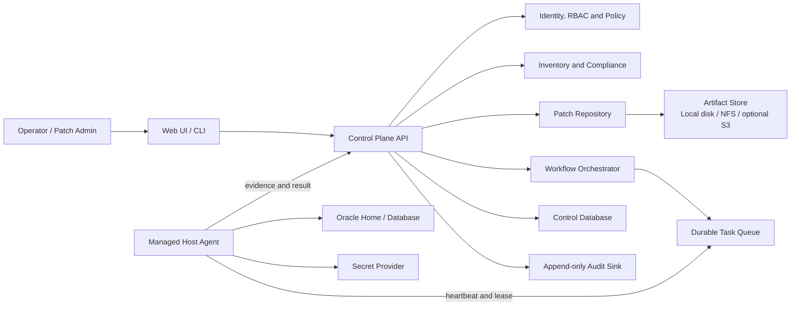
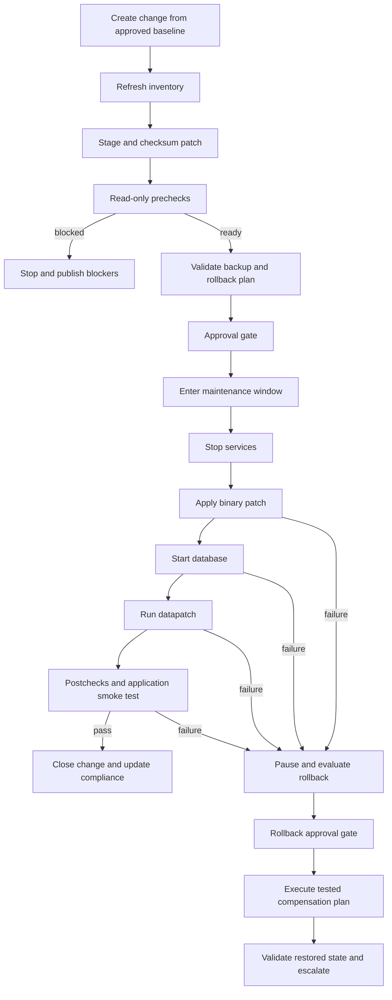

# Oracle Patching Utility Architecture

This architecture is for a greenfield system. Prior patching utilities are not
dependencies or implementation baselines; every contract and component will be
created and verified in this repository.

## 1. Objective

Build a safe service that can discover Oracle installations, determine patch
compliance, prove readiness, execute an approved patch workflow, validate the
result, and support a rehearsed rollback path.

The utility must make patching repeatable without turning the platform into a
general-purpose remote administration tool.

## 2. Architectural principles

1. **Safety before automation.** A failed mandatory precheck blocks execution.
2. **Deterministic execution.** Agents run typed, versioned task definitions;
   they never execute free-form commands supplied by a user, UI, or AI model.
3. **Separation of duties.** Request, approve, execute, and audit permissions
   are distinct.
4. **Pull-based agents.** Agents authenticate to the control plane, lease work,
   and send heartbeats/results. The server does not require inbound SSH.
5. **Evidence for every transition.** Each workflow step records its inputs,
   actor, timestamps, outputs, exit classification, and evidence checksum.
6. **Idempotency and resumability.** A retry must not repeat an already
   completed destructive operation.
7. **Rollback is designed, not improvised.** A workflow cannot enter its
   execution window without a validated rollback plan and recovery evidence.
8. **Secrets never enter logs or task payloads.** Agents resolve short-lived
   credentials from an approved secret provider.
9. **AI is advisory only.** It may summarize evidence or propose a plan; it
   cannot approve, dispatch, or execute a patch step.

## 3. Scope and assumptions

### Release 1

- Oracle Database 19c on Oracle Linux x86-64
- Initial executable certification on Oracle Linux 8 and 9
- Database Release Updates (RU), followed by OJVM as a separate patch family
- Standalone database workflow
- OPatch and datapatch integration
- Read-only discovery and readiness checks
- Human approval before service interruption and before rollback
- Deployment-neutral artifact storage through a repository interface; a local
  filesystem or shared NFS path is sufficient for the first release

### Release 1.1

- Data Guard topology discovery and standby-first orchestration
- Switchover checkpoints and replication-health validation

### Later adapters

- Grid Infrastructure and RAC rolling/non-rolling workflows
- Exadata-specific orchestration
- Windows hosts
- Oracle Restart, GoldenGate, and application middleware coordination

The topology adapter is deliberately separate from patch mechanics so these
capabilities do not require a control-plane redesign.

## 4. System context

## 5. Major components

### 5.1 Control Plane API

Provides versioned APIs for inventory, patch baselines, change requests,
prechecks, workflows, approvals, schedules, evidence, and reports. API methods
enforce authorization and optimistic concurrency.

### 5.2 Identity, RBAC, and policy

Initial roles:

| Role | Responsibility |
| --- | --- |
| Platform admin | Configuration, agent enrollment, identity integration |
| Patch admin | Patch catalog, baselines, workflow creation |
| Approver | Approve/reject gated transitions |
| Operator | Run approved workflows and respond to pauses |
| Auditor | Read evidence, history, and reports |
| Viewer | Read inventory and compliance only |

Policy rules cover maintenance windows, environment criticality, minimum backup
age, allowed patch families, concurrency limits, and required approvals.

### 5.3 Inventory and topology service

Stores hosts, Oracle homes, databases, listeners, services, current SQL patch
registry, OPatch inventory, and topology relationships. Discovery observations
are immutable snapshots; the current inventory is a projection of the latest
accepted observations.

### 5.4 Patch catalog and repository

Stores patch metadata independently from patch binaries:

- Oracle patch ID, family, target version, platform, release date
- prerequisites, supersedence, conflicts, OPatch minimum version
- archive size and SHA-256 digest
- README/reference metadata and approval status
- immutable artifact location, storage-provider type, and retention state

Only verified and approved artifacts can be staged to a host. Oracle Support
downloads should be performed through an explicitly licensed/manual ingestion
path unless a compliant automated integration is approved.

### 5.5 Compliance engine

Compares observed inventory with an approved baseline and produces explainable
states: `compliant`, `update_required`, `not_applicable`, `exception`, or
`unknown`. It does not start workflows automatically in the first release.

### 5.6 Workflow orchestrator

Runs a persisted directed acyclic graph (DAG). It owns dependencies, gates,
timeouts, retries, cancellation, pause/resume, compensation, and concurrency.
It dispatches typed tasks to agents but contains no shell or Oracle execution
logic.

### 5.7 Managed host agent

Runs under a dedicated OS account with narrowly scoped privilege escalation.
Its executable catalog is signed/versioned and includes operations such as:

- collect Oracle/OPatch inventory
- verify archive checksum and safely extract a patch
- run OPatch conflict and system-space analysis
- query database state and SQL patch registry
- verify RMAN backup evidence and restore-point policy
- stop/start approved Oracle services through topology adapters
- apply or roll back a specific approved patch ID
- run datapatch and post-patch validation

Each operation validates structured parameters, uses `shell=False`-equivalent
process invocation, enforces timeouts, redacts secrets, and returns a standard
result envelope.

### 5.8 Evidence, audit, and reporting

Audit records are append-only. Large logs and reports are stored as immutable
evidence files through the same artifact-store abstraction, with digest and
retention metadata stored in the database. Reports include compliance,
readiness, workflow timeline, before/after inventory, exceptions, and rollback
activity.

### 5.9 Deployment-neutral artifact store

Patch archives and large evidence are accessed only through an `ArtifactStore`
interface. Business logic must not contain S3 bucket names, cloud SDK types, or
provider-specific URLs. The interface provides streaming upload/download,
digest verification, atomic publish, existence checks, and retention actions.

Supported adapters are independent deployment choices:

| Adapter | Intended deployment |
| --- | --- |
| Local filesystem | Single-node development, lab, or small installation |
| Shared filesystem/NFS | Fully on-premises multi-node production |
| S3-compatible API | Optional private-cloud or public-cloud deployment |

The default is a POSIX filesystem adapter with a content-addressed layout such
as `sha256/<prefix>/<digest>`. The database stores a logical artifact ID and
digest—not a provider-specific URL. This allows storage adapters to be changed
or migrated without changing patch, workflow, or evidence records.

## 6. Standalone RU workflow

Mandatory prechecks include agent health, archive digest, patch applicability,
OPatch version, existing inventory, conflict analysis, disk and filesystem
space, database/open-mode state, invalid objects, registry errors, active jobs,
backup recency, recovery destination capacity, and maintenance-window validity.

## 7. Workflow state model

Workflow states:

`draft -> prechecking -> blocked|awaiting_approval -> scheduled -> running ->`
`paused|succeeded|failed -> rollback_pending -> rolling_back -> rolled_back`

Rules:

- Terminal states are immutable.
- Every state change uses a compare-and-set version to prevent duplicate work.
- An agent task has an idempotency key: workflow, node, attempt, and target.
- A lease timeout returns a task to reconciliation; it does not immediately
  assume the underlying Oracle operation failed.
- Destructive steps require postcondition probing before any retry.

## 8. Core data model

| Entity | Purpose |
| --- | --- |
| Host / Agent | Target identity, enrollment, health, capabilities |
| OracleHome | Home path, owner, version, OPatch level, installed patches |
| Database / Topology | SID/DB unique name, role, services, peer relationships |
| DiscoverySnapshot | Immutable observation and collected evidence |
| PatchArtifact | Patch metadata, digest, storage reference, approval state |
| PatchBaseline | Desired patch level by platform/environment |
| ComplianceResult | Explainable comparison of observation and baseline |
| ChangeRequest | Business scope, targets, window, risk, approvals |
| Workflow / Node / Attempt | Persisted orchestration graph and execution history |
| Approval | Actor, decision, scope, timestamp, comment |
| Evidence | Immutable log/report reference and checksum |
| AuditEvent | Append-only security and business event |

PostgreSQL is the recommended system of record. Patch archives and large
evidence use the `ArtifactStore` interface; local disk is the development
default and a shared filesystem is the on-premises production default. A
durable broker may be introduced for scale, but the first vertical slice can
use database-backed leasing to keep the failure model small.

## 9. Agent protocol and trust

1. An administrator creates a one-time enrollment token.
2. The agent enrolls and receives a client certificate or workload identity.
3. The agent sends heartbeats containing version and capabilities.
4. It long-polls for tasks addressed to its stable host identity.
5. It verifies task schema, policy snapshot, expiry, artifact digest, and task
   signature before execution.
6. It streams redacted structured events and uploads final evidence.
7. The control plane reconciles the reported postconditions with fresh
   discovery data.

TLS is mandatory. Production should use mutual TLS, certificate rotation, and
an external secrets manager. Patch archives are never accepted without digest
verification, and archive extraction rejects path traversal and unsafe links.

## 10. Failure and recovery model

- **Control plane unavailable:** the agent finishes only the currently leased,
  explicitly offline-safe step; it does not begin a new destructive step.
- **Agent lost during execution:** workflow pauses; reconciliation probes the
  actual Oracle state before retry or rollback.
- **Partial OPatch/datapatch result:** preserve evidence, classify the observed
  state, and require operator/approver action.
- **Stale inventory:** destructive work is blocked until refreshed.
- **Expired maintenance window:** no new disruptive step starts.
- **Audit/evidence write failure:** execution stops before the next step.

## 11. Deployment model

Begin as a modular control plane plus a separate managed agent:

- Bash 4.4+ managed host agent for fixed Oracle Linux operations
- control-plane implementation behind versioned contracts; its language is a
  separate decision and cannot expand the agent execution boundary
- PostgreSQL
- local filesystem or NFS artifact storage by default
- optional S3-compatible adapter when the deployment chooses it
- reverse proxy/identity provider integration
- one managed agent per database host

This keeps transaction boundaries and operations understandable. Inventory,
repository, workflow, and reporting modules expose internal interfaces and can
be separated later if measured load or ownership requires it.

The Bash agent does not interpret free-form scripts. A literal registry maps an
operation name and version to package-owned code. Operations publish typed JSON
results, evidence digests, source coverage, and a durable local journal. Bash
is the execution language, not an authorization or input-validation shortcut.

## 12. Observability and service objectives

- Structured logs with correlation IDs for change, workflow, task, and target
- Metrics for agent health, queue age, step duration, success rate, blockers,
  compliance, and rollback count
- Alerts for stale heartbeat, stuck lease, expired window, failed validation,
  evidence-write failure, and unapproved baseline drift
- Distributed traces across API, worker, repository, and agent calls

Initial objectives: no duplicate destructive execution; 100% of execution
steps linked to an actor/change/evidence record; agent-health detection within
two heartbeat intervals; control-plane recovery without losing workflow state.

## 13. Explicit non-goals

- Generic SSH, arbitrary shell, or user-supplied SQL execution
- Automatic patching based only on a compliance result
- Scraping or bypassing Oracle Support licensing controls
- AI-driven execution or approval
- Pretending all failure modes can be automatically rolled back

## 14. Decisions to validate during the first vertical slice

- Enterprise identity provider and secret manager
- Artifact-store adapter (local disk, NFS, or optional S3-compatible storage)
  and retention policy
- Backup evidence source (RMAN catalog, database views, or enterprise backup API)
- Service stop/start integration point for each environment
- Change-management integration (for example ServiceNow)
- Required Data Guard and RAC rollout sequence
