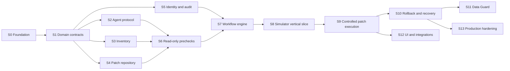

# Implementation Subprojects and Build Order

All subprojects start from new contracts and new code in this repository. No
module, schema, task definition, or deployment artifact will be copied from an
older patching utility.

This document is the release-level summary. The independently assignable work
packages and parallel delivery waves are defined in the
[`complete blueprint`](../Oracle_Patching_Utility_Blueprint.md); program invariants and quality gates
are defined in [`PROGRAM_CHARTER.md`](PROGRAM_CHARTER.md).

The architecture is delivered as small subprojects with explicit contracts.
Each subproject should be implemented and accepted independently. We will not
write the patch-apply operation until the read-only vertical slice, workflow
gates, evidence trail, and simulated failure paths are proven.

## Dependency map

## S0 — Repository and engineering foundation

**Deliver:** Bash agent project layout, a fixed operation registry, local
journaling and evidence primitives, configuration boundaries, coding standards,
CI, unit/integration fixtures, and architecture decision records. Control-plane
module and database choices remain a separate package behind shared contracts.

**Acceptance:** `make check` validates syntax and runs all agent tests;
configuration and secrets are separated; no mutating patch operation exists.

## S1 — Domain contracts and lifecycle

**Deliver:** typed models for inventory, patches, baselines, changes, workflows,
tasks, results, evidence, and audit; state transition rules; stable error codes;
JSON schemas shared by server and agent.

**Acceptance:** invalid transitions and malformed tasks fail deterministically;
schemas have compatibility tests and example fixtures.

## S2 — Agent enrollment, heartbeat, and task leasing

**Deliver:** agent identity/enrollment, authenticated heartbeat, capability
reporting, database-backed task queue, lease/renew/complete protocol, event
upload, and a fake executor.

**Acceptance:** duplicate delivery is safe; expired leases reconcile correctly;
an offline agent is detected; arbitrary commands cannot enter a task payload.

## S3 — Oracle discovery and inventory

**Deliver:** fixed read-only collectors for OS facts, Oracle homes, OPatch
inventory, database identity/open mode, registry history, services, and initial
topology; snapshot storage and inventory API.

**Acceptance:** repeat discovery is idempotent; fixtures cover missing tools,
multiple homes, down databases, and partial permission; no mutation occurs.

## S4 — Patch catalog, repository, and compliance

**Deliver:** manual/licensed artifact ingestion, metadata validation, SHA-256
verification, safe extraction inspection, a provider-neutral `ArtifactStore`,
local-filesystem adapter, baseline management, and explainable compliance
evaluation. NFS works through the filesystem adapter; S3 support is optional.

**Acceptance:** corrupt/unsafe archives are rejected; baseline changes are
audited; compliance results include machine-readable reasons.

## S5 — Authentication, authorization, policy, and audit

**Deliver:** identity-provider interface, local development auth, RBAC,
environment policies, separation-of-duties rules, append-only audit events, and
log redaction.

**Acceptance:** permission matrix tests pass; requester cannot self-approve
where policy forbids it; secrets never appear in test logs.

## S6 — Read-only readiness engine

**Deliver:** typed prechecks for checksum, applicability, OPatch version,
conflicts, disk/system space, DB state, registry health, invalid objects,
backup evidence, recovery capacity, agent freshness, and maintenance window.

**Acceptance:** every check emits `pass`, `warning`, `blocker`, or `unknown`
with evidence; any mandatory blocker prevents workflow approval.

## S7 — Workflow orchestration and approvals

**Deliver:** persisted DAG engine, dependency validation, approval gates,
scheduling, concurrency policy, pause/resume/cancel, retries, reconciliation,
and compensation-plan representation.

**Acceptance:** crash/restart tests lose no state; retries probe postconditions;
rollback order is reverse dependency order; expired windows pause safely.

## S8 — End-to-end simulator vertical slice

**Deliver:** simulated Oracle host/agent capable of success and injected
failures; run discovery -> compliance -> precheck -> approval -> simulated
apply -> validation -> close/rollback through the real APIs and workflow.

**Acceptance:** full audit/evidence chain exists; failure at every node produces
the documented state; no real Oracle software is touched.

## S9 — Controlled standalone RU execution

**Deliver:** safe staging, service stop/start adapter, OPatch apply operation,
database startup, datapatch, SQL validation, post-discovery, and smoke-test hook.
Every operation has preconditions, postconditions, timeout, and redaction.

**Acceptance:** Oracle lab tests cover already-applied, conflict, partial
failure, agent loss, slow datapatch, and successful patch; production remains
disabled behind a feature/policy gate until formal sign-off.

## S10 — Rollback and recovery

**Deliver:** OPatch rollback where supported, SQL rollback handling, restore
point/backup recovery handoff, manual intervention state, runbooks, and drills.

**Acceptance:** lab rollback drills prove before/after inventory and evidence;
unsupported automatic cases stop with precise operator instructions.

## S11 — Data Guard topology adapter

**Deliver:** primary/standby discovery, lag and broker checks, standby-first
plan, switchover gates, service validation, and topology-aware rollback rules.

**Acceptance:** lab scenarios cover healthy, lagging, disconnected, failed
switchover, and reinstate-required states.

## S12 — User interface and enterprise integrations

**Deliver:** inventory/compliance dashboard, change wizard, precheck evidence,
approval inbox, live workflow timeline, reports, notifications, and interfaces
for change management, backup systems, and monitoring.

**Acceptance:** UI cannot bypass server policy; accessibility and authorization
tests pass; external integration failure cannot silently approve work.

## S13 — Production hardening and pilot

**Deliver:** mTLS and certificate rotation, secret-manager integration, HA,
backup/restore, retention, signed releases/SBOM, vulnerability scans, load and
failure testing, operational runbooks, and a limited pilot.

**Acceptance:** threat model and recovery test are signed off; SLO alerts work;
pilot scope and rollback criteria are documented; no critical security finding
is open.

## Recommended execution sequence

1. Build S0 and S1 together as the contract foundation.
2. Build S2–S5 as parallelizable modules once contracts stabilize.
3. Join them in S6 and S7.
4. Prove the system in S8 before adding real patch execution.
5. Add standalone execution and recovery in S9–S10.
6. Expand topology and operator experience in S11–S12.
7. Complete S13 before a production rollout.

## First implementation slice

Start with **S0 — Repository and engineering foundation**. The first executable
slice contains the Bash agent skeleton, typed read-only operations, local
journaling, fixtures, the `make check` quality command, and architecture
decision records. It contains no patch-apply operation. The next slice deepens
discovery accuracy before any mutation handler is registered.
