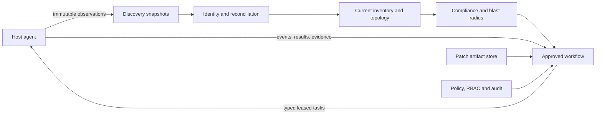

# Oracle Patching Utility Program Charter

## Mission

Build a greenfield, deployment-neutral Oracle estate discovery and patching
platform with OEM-style managed agents, deterministic workflows, and evidence
for every decision and operation.

The program optimizes for **correctness and safety first**, then delivery speed.
Speed comes from parallel work on small components with stable contracts—not
from combining discovery, policy, and patch execution into one large module.

## Non-negotiable rules

1. The agent discovers dynamically; administrators do not manually recreate
   the Oracle estate in the platform.
2. Discovery is read-only and independent from patch-execution privileges.
3. Observations are immutable. Current inventory is a deterministic projection
   produced by reconciliation.
4. Missing data from a partial scan never means a resource was deleted.
5. Names, SIDs, hostnames, IP addresses, and Data Guard roles are attributes,
   not stable identities.
6. Every material fact retains source, collection time, confidence, collector
   version, and evidence digest.
7. The agent executes fixed, typed operations; there is no arbitrary shell or
   control-plane-supplied SQL.
8. Patch execution requires fresh discovery, completed prechecks, policy
   validation, approval, an active maintenance window, and recovery evidence.
9. A retry of a destructive step first probes actual Oracle state.
10. Cloud services are optional adapters. The full platform must operate with
    on-premises PostgreSQL and filesystem/NFS artifact storage.
11. AI may explain or propose; it cannot approve, dispatch, or execute.
12. Standalone Oracle 19c on Oracle Linux is proven before Data Guard, then RAC/GI.

## System boundaries

### Field ownership

| Owner | Example fields |
| --- | --- |
| Agent | Versions, paths, runtime role, open mode, installed patches, capacity |
| Administrator | Environment, criticality, owner, maintenance window, policy |
| Integration | CMDB ID, backup-system evidence, change ticket |
| Computed | Compliance, confidence, staleness, topology risk, blast radius |

Reconciliation cannot overwrite fields owned by administrators or integrations.

## Delivery organization

The program is divided into workstreams with one accountable contract owner:

| Workstream | Owns |
| --- | --- |
| Architecture/contracts | Canonical models, schemas, lifecycle, compatibility |
| Agent platform | Enrollment, identity, heartbeat, leasing, safe runner, upgrades |
| Discovery | Host, Oracle home, DB, listener, Data Guard, GI/RAC collectors |
| Inventory | Snapshots, identity matching, reconciliation, topology, history |
| Artifact/compliance | Storage abstraction, patch catalog, baseline, compliance |
| Security/governance | RBAC, policy, approvals, secrets, audit, threat model |
| Workflow | DAG, scheduling, gates, retries, reconciliation, compensation |
| Oracle execution | Prechecks, staging, OPatch, datapatch, validation, rollback |
| Experience/integration | API, UI, reporting, notifications, enterprise adapters |
| Quality/platform | Simulator, Oracle labs, CI, release, observability, operations |

Parallel workstreams share schemas and test fixtures; they do not share internal
database tables or bypass published interfaces.

## Accuracy model

Accuracy is measured, not asserted.

- **Entity accuracy:** discovered resources match independent DBA ground truth.
- **Relationship accuracy:** home-to-database and topology relationships are
  correct, including shared-home blast radius.
- **Identity stability:** restarts, role changes, service relocation, and agent
  upgrades do not create duplicate resources.
- **Coverage:** every snapshot reports which sources were successfully queried.
- **Freshness:** policy blocks workflows using stale inventory.
- **Execution correctness:** observed postconditions match expected results.
- **Audit completeness:** every transition links actor, policy, task, and
  evidence.

No team may improve a metric by hiding `unknown`, `partial`, or `conflict`
states. Those states are valid safety outcomes.

## Quality gates

### Q0 — Contract gate

- Canonical resource identities and field ownership are documented.
- JSON schemas and lifecycle transition tests pass.
- Compatibility is demonstrated across current and previous protocol versions.

### Q1 — Read-only safety gate

- Discovery has no arbitrary shell or SQL path.
- Privilege rules, path validation, timeouts, output limits, and redaction pass
  security review and negative tests.

### Q2 — Discovery accuracy gate

- Known standalone lab estate reaches at least 99% entity and relationship
  correctness against DBA-verified ground truth.
- Repeated scans produce no duplicates.
- Stopped resources remain represented.

### Q3 — Degraded-operation gate

- Permission failure, corrupt inventory, down listener, unavailable database,
  lost network, and partial upload produce explicit partial results.
- Partial scans never delete resources.
- Ambiguous identities enter conflict quarantine.

### Q4 — Workflow simulation gate

- Every node can fail through injection.
- Restart, duplicate delivery, lease expiry, pause, approval, window expiry,
  and rollback ordering are proven without touching Oracle software.

### Q5 — Standalone Oracle lab gate

- Successful apply, already-applied, conflict, insufficient space, agent loss,
  OPatch failure, datapatch failure, and rollback are exercised.
- Before/after discovery and immutable evidence are complete.

### Q6 — Topology gate

- Data Guard role changes preserve database identity.
- RAC instance/service movement preserves database and cluster identity.
- Topology-specific order is selected only from verified patch capability and
  current topology—not guessed from the patch family.

### Q7 — Pilot and production gate

- Threat model, recovery test, DBA validation, operational runbooks, SLOs,
  certificate rotation, release signing, and support procedures are approved.
- Production execution remains disabled until this gate is signed off.

## Change discipline

- Every work package has a written interface and acceptance test before code.
- Schema changes require compatibility impact and migration tests.
- Oracle command parsers require versioned golden-output fixtures.
- Safety invariants require negative tests, not only success-path tests.
- A module is not complete when its code works in isolation; it is complete
  when its contract, failure behavior, telemetry, and evidence are verified.
- High-risk execution components require independent review by a DBA and a
  security/platform reviewer.

## Release boundaries

- **R0:** contracts, simulator, and engineering foundation.
- **R1:** read-only agent discovery, inventory, compliance, and prechecks.
- **R2:** standalone Oracle 19c RU execution and rehearsed recovery in a lab.
- **R3:** limited non-production standalone pilot.
- **R4:** Data Guard support.
- **R5:** Grid Infrastructure/RAC support.
- **R6:** broader Oracle/platform versions based on tested adapters.

No release boundary is date-driven. It advances only after its quality gates
pass with retained evidence.
